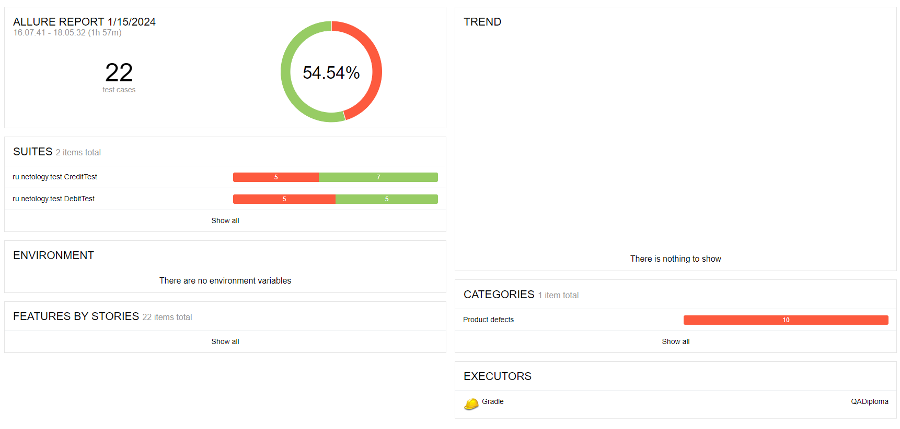

# Отчет по тестированию

##  Описание
В ходе тестирования веб-сервиса, предоставляющего возможность покупки тура двумя способами: обычной оплатой по дебетовой карте и уникальной технологией — выдачей кредита по данным банковской карты, было проведено ручное и автоматизированное тестирование позитивных и негативных сценариев покупки тура.

## Результаты тестирования
* Количество тест-кейсов: 22.
* Процент успешных тест-кейсов: 54,54% (12 тест-кейсов).
* Процент неуспешных тест-кейсов: 45,45% (10 тест-кейсов).

## Общие рекомендации
1. Добавить тестовые селекторы к элементам страницы.
2. Разработать требования к приложению и работе с БД.
3. Исправить баги: [Issues](https://github.com/Ekaterlna/QADiploma/issues).
